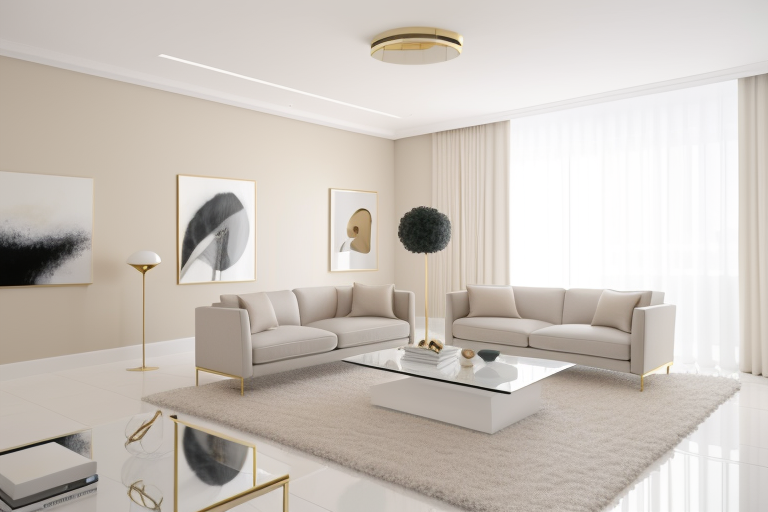

# 🏠 室内设计风格多模态智能体与 LoRA 微调系统

> 从业务数据集 → LoRA 微调 → RAG 知识库 → Agent 编排 → Web 展示，完整打通 AI 室内设计生产链路。

---

## ✨ 效果预览

| 侘寂风书房 | 法式奶油风客厅 | 现代轻奢客厅 |
|:---:|:---:|:---:|
| 原木书架 + 纸灯 + 留白 | 拱形窗 + 石膏线 + 丝绒椅 | 落地窗 + 大理石 + 黄铜 |
|  |  |  |

> 更多作品集样张保存在 [`outputs/`](./outputs) 目录。

---

## 📁 项目结构

```
interior-design-ai-agent/
├── config.py                          # 全局配置（LLM、ComfyUI、LoRA、路径）
├── .env                               # API Key 环境变量（不提交）
├── requirements.txt                   # Python 依赖
├── README.md                          # 本文件
│
├── outputs/                           # 生成效果图
│
├── module1_lora/                      # 模块一：LoRA 微调
│   ├── data_prep.py                   #   数据采集、清洗、打标脚本
│   └── train_config.toml              #   kohya_ss 训练配置文件
│
├── module2_rag/                       # 模块二：RAG 知识库
│   ├── design_knowledge/              #   设计规范文档
│   │   ├── wabi_sabi.md               #     侘寂风规范
│   │   ├── french_cream.md            #     法式奶油风规范
│   │   ├── lighting_standards.md      #     灯光色温标准
│   │   └── material_pbr.md            #     材质 PBR 参数
│   ├── build_knowledge_base.py        #   文档切片 + 向量化 + 存入 ChromaDB
│   └── query_knowledge.py             #   查询接口
│
├── module3_agent/                     # 模块三：Agent 编排
│   ├── agent_pipeline.py              #   主控管道（需求→RAG→LLM→图像）
│   ├── prompt_templates.py            #   Prompt 工程模板
│   └── comfyui_client.py              #   ComfyUI API 客户端
│
└── module4_demo/                      # 模块四：Web 展示
    └── app.py                         #   Gradio 网页界面（UI 全面优化版）
```

---

## 🚀 快速开始

### 1. 安装依赖

```bash
cd interior-design-ai-agent
pip install -r requirements.txt --break-system-packages
```

### 2. 配置 API Key

创建 `.env` 文件（参考 `.env.example`）：

```env
LLM_API_BASE=https://api.deepseek.com/v1
LLM_API_KEY=sk-xxxxxxxxxxxxxxxxxxxxxxxxxxxxxxxx
LLM_MODEL=deepseek-chat
```

或用本地 Ollama 替代，编辑 `config.py` 取消对应注释。

### 3. 构建 RAG 知识库（只需运行一次）

```bash
python module2_rag/build_knowledge_base.py
```

首次运行会自动下载 `bge-small-zh-v1.5` 嵌入模型（约 100MB）。

### 4. 启动 Agent（命令行）

```bash
python module3_agent/agent_pipeline.py "设计一个20平米的侘寂风客厅，带落地窗，空间要有呼吸感"
```

如果 ComfyUI 未运行，Agent 仍然会输出完整的提示词和设计分析。

### 5. 启动 Web 界面

```bash
python module4_demo/app.py
```

浏览器打开 `http://127.0.0.1:7860`。

---

## 🌐 Web UI 界面说明

UI 经过全新设计，采用温暖、安静、有呼吸感的视觉语言：

- **深棕渐变顶部横幅** — 品牌标题 "Atelier · 室内设计智能体" + 风格标签
- **左侧白色卡片式输入面板** — 5 行文本框 + 复选框 + 设计分析区
- **右侧双标签页输出** — "Agent 推理过程" / "生成提示词" 切换
- **图片输出** — 圆角阴影展示
- **示例快捷入口** — 4 个预设设计需求一键填充
- **状态栏** — 实时显示 ComfyUI 连接状态和系统信息

---

## 📐 四个模块详解

### 模块一：LoRA 微调

1. **准备数据**：收集 50-200 张目标风格的高清效果图
2. **运行预处理**：`python module1_lora/data_prep.py --input_dir ./raw --output_dir ./training_data --style wabisabi`
3. **配置 kohya_ss**：用 `train_config.toml` 中的参数（Rank=32, LR=1e-4）
4. **训练**：在 4090/云端 3090 上跑通 LoRA 训练
5. **可视化对比**：基础模型 vs 加了 LoRA 的效果对比图 + loss 曲线

### 模块二：RAG 知识库

- 4 份设计规范文档（侘寂风、奶油风、灯光标准、材质 PBR）
- 使用 `bge-small-zh-v1.5` 中文嵌入模型
- ChromaDB 本地向量数据库
- 文档自动切片（512 tokens/chunk，64 overlap）

### 模块三：Agent 编排

- **意图识别**：自动检测风格类型和房间类型
- **RAG 检索**：查询设计知识库获取专业规范
- **LLM 推理**：DeepSeek/Qwen 生成高质量英文 Prompt
- **ComfyUI 调用**：通过 REST API 提交生成任务
- **LoRA 绑定**：自动在提示词中注入 LoRA 触发词

### 模块四：Web Demo

**展示给面试官的点**：你有产品化的思维，不只是跑脚本。

- Gradio 网页界面，左侧输入 → 右侧出图
- 实时展示 Agent 推理过程和中间产物
- 可切换查看：推理过程 / 生成提示词 / 设计分析
- 响应式设计，适配桌面和移动端
- 自定义设计语言：温暖色调、卡片布局、圆角阴影

---

## 🎓 面试话术指南

当面试官问"你做过什么 AI 项目"时，这样介绍：

> "我做了一个**室内设计风格多模态智能体**。这个项目的核心不是跑 SD 出图，而是我完整搭建了一条从数据到产品的 AI 生产链路。
>
> 第一，我用 kohya_ss 对特定风格（比如侘寂风）做了 **LoRA 微调**，收集了 100+ 张高清效果图，自己洗数据、打标、调参、看 loss 曲线。
>
> 第二，我搭了一个 **RAG 知识库**，把室内设计规范、灯光标准、材质参数用 bge 嵌入模型向量化后存到 ChromaDB，这样 Agent 生成的时候有专业知识兜底，不是瞎编。
>
> 第三，我用 LangChain 做了一个 **Agent 编排**，用户输入中文需求，Agent 先去知识库查规范，再调用大模型生成 Prompt，最后自动发给 ComfyUI 渲染出图，全程自动化。
>
> 第四，我用 Gradio 做了一个网页 Demo，可以直接演示给面试官看——输入设计需求，实时出图，中间每一步的推理过程都可见。"

---

## ⚙️ 依赖与硬件要求

| 组件 | 最低要求 | 推荐配置 |
|------|---------|---------|
| LoRA 训练 | GPU 8GB 显存 | RTX 3090/4090 (24GB) |
| RAG 知识库 | CPU 即可 | 任意 |
| Agent 推理 | 无（调 API） | DeepSeek API / Ollama 本地 |
| ComfyUI 推理 | GPU 8GB 显存 | RTX 3060+ |
| Gradio Web | CPU 即可 | 任意 |

---

## 问题

**Q: 没有 GPU 能跑吗？**
A: 模块二（RAG）和模块四（Web）不需要 GPU。模块一的 LoRA 训练和模块三的图像生成需要 GPU，但可以用云端 GPU。

**Q: 不用 ComfyUI 可以用 Automatic1111 吗？**
A: 可以，修改 `module3_agent/comfyui_client.py` 中的 API 调用为 A1111 的 `/sdapi/v1/txt2img` 接口即可。

**Q: 知识库文档太少怎么办？**
A: 往 `module2_rag/design_knowledge/` 目录添加更多 `.md` 文件，然后重新运行 `build_knowledge_base.py`。

---

## 📄 License

MIT — 自由使用、修改、分发。
